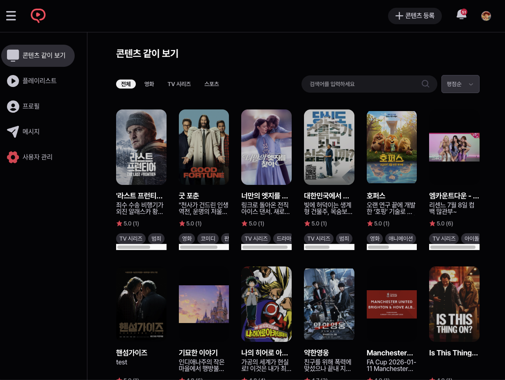

<div align="center">
  <h1>모두의 플리 (MOPL) - 글로벌 컨텐츠 큐레이션 플랫폼</h1>
  <p><strong>코드잇 스프린트 백엔드 10기 Part 4 Team 1</strong></p>
  <p>Spring Boot 기반 대용량 트래픽 대비 글로벌 콘텐츠 큐레이션 백엔드 API 서비스</p>
</div>

<br/>

<div align="center">

[](https://codecov.io/gh/sb10-part4-team1/sb10-mopl-team1)
</div>

<br/>

<div align="center">
  <a href="https://mopl-sb10.click/">🌐 서비스 홈페이지</a>
  &nbsp; | &nbsp;
  <a href="https://innovative-othnielia-5b4.notion.site/1-455c610be52b82018edf018518dab64b">📚 팀 협업 문서</a>
  &nbsp; | &nbsp;
  <a href="(제작한 발표자료 링크 혹은 첨부파일 첨부)">📄 프로젝트 회고록</a>
  &nbsp; | &nbsp;
  <a href="(제작한 발표자료 링크 혹은 첨부파일 첨부)">📄 발표자료</a>
</div>

<br/>

<div align="center">
  
</div>

---

## ✍️ 프로젝트 소개

- **소속:** 코드잇 스프린트 백엔드 10기 Part 4 Team 1
- **프로젝트명:** 모두의 플리(MOPL) - 글로벌 컨텐츠 큐레이션 플랫폼 Spring 백엔드 시스템 구축
- **프로젝트 기간:** 2026.06.19 ~ 2026.07.29
- **구현 홈페이지:** [모두의 플리](https://mopl-sb10.click/)
- **주요 목표:** Spring Boot, Spring Security, Spring Data JPA 기반 인프라 위에 **AWS ALB(Load Balancer)를 통한 부하
  분산 및 Auto Scaling**, **Apache Kafka 기반 분산 서버간 실시간 이벤트 발행/구독**, **Redis 캐싱 처리 및 세션 관리**를 적용하여 **대용량
  트래픽에 안정적으로 대응 가능한 고가용성 백엔드 시스템** 구축

---

## 🧑‍💻 팀원 소개

|                                     프로필                                      |   이름    |                         담당 역할                         |                                                           GitHub                                                            |
|:----------------------------------------------------------------------------:|:-------:|:-----------------------------------------------------:|:---------------------------------------------------------------------------------------------------------------------------:|
|   | **신지연** |         **팀장** / 백엔드 (실시간 서비스, 알림, DM, 시청 세션)         | [](https://github.com/Nooroong) |
|  | **성주현** |     백엔드 (인증·인가, OAuth2, 소프트 탈퇴, 관리자, Swagger, CI)     |  [](https://github.com/jh9dev)  |
|  | **문정환** | 백엔드 (초기 Init/CodeRabbit, Codecov, 플리, 리뷰, 팔로우, 마이페이지) | [](https://github.com/mjohn26)  |
|   | **박성국** |   백엔드 (콘텐츠/배치 수집, CD, Docker, 프로필/로그, 모니터링, 부하테스트)    |  [](https://github.com/PSG-00)  |

---

## ⚙️ 기술 스택

<table>
  <thead>
    <tr>
      <th>분류</th>
      <th>기술 스택</th>
    </tr>
  </thead>
  <tbody>
    <tr>
      <td><strong>Backend & Framework</strong></td>
      <td>
        
        
        
        
        
        
        
        
        
        
        
      </td>
    </tr>
    <tr>
      <td><strong>Database & Cache</strong></td>
      <td>
        
        
        
      </td>
    </tr>
    <tr>
      <td><strong>Infra & DevOps</strong></td>
      <td>
        
        
        
        
        
        
      </td>
    </tr>
    <tr>
      <td><strong>Tools & Quality</strong></td>
      <td>
        
        
        
        
        
        
        
        
      </td>
    </tr>
  </tbody>
</table>

---

## 📌 팀원별 구현 기능 상세

### 👤 신지연 (팀장)

<div align="center">
  
</div>

- **SSE(Server-Sent Events) 기반 실시간 알림 시스템**
    - SseEmitter 수명 주기 관리 및 타임아웃/자동 재연결 비동기 처리
    - 팔로우, 리뷰 작성, 실시간 동시 시청 초청 등 이벤트를 비동기 Pub/Sub 구조로 실시간 알림 전송
- **WebSocket & STOMP 기반 실시간 1:1 및 그룹 DM (`Conversation`)**
    - 대화방(Conversation) 및 참여자(Participant) 데이터 모델링 및 엔티티 구현
    - STOMP 프로토콜을 활용한 메시지 실시간 송수신, 읽음 처리, 대화 히스토리 페이징 조회 API
- **실시간 함께 보기 시청 세션 (`WatchingSession`)**
    - 동영상 및 콘텐츠를 여러 사용자가 동시 시청할 수 있는 실시간 세션 방 생성 및 참가자 관리
    - Play, Pause, Seek(재생 위치 변경) 등 시청 상태 실시간 브로드캐스팅 및 동기화

---

### 👤 성주현

<div align="center">
  
</div>

- **Spring Security & JWT 기반 인증/인가 체계**
    - Access Token(JJWT) 및 Refresh Token(Redis) 발급/검증 및 자동 갱신 보안 인프라 구축
    - Custom Security Filter 및 Handler를 통한 Stateless 인증 인프라
- **OAuth2 소셜 로그인 & 비밀번호 재설정**
    - Google 및 Kakao OAuth2 Client 연동을 통한 간편 소셜 로그인 API
    - `JavaMailSender`를 활용한 임시 비밀번호 발급 및 이메일 전송 API
- **소프트 삭제(Soft Delete) 방식 회원 탈퇴 처리**
    - 회원 탈퇴 요청 시 개인정보 익명화 처리 및 소프트 삭제(Soft Delete) 전환으로 데이터 일관성 보존
- **관리자 전용 회원 및 권한 관리 API (`Admin`)**
    - 전체 사용자 목록 조회, 검색, 계정 상태 변경 및 관리자 권한 부여/회수 API
- **Swagger (SpringDoc OpenAPI 3) API 문서화 총괄**
    - 전사 RESTful API 명세화 및 Swagger UI 적용으로 프론트엔드/백엔드 협업 효율성 증대
- **GitHub Actions 기반 CI(Continuous Integration) 파이프라인 구축**
    - Spotless (`spotlessCheck`) 코드 포맷팅 자동 검증
    - Checkstyle (`checkstyleMain`, `checkstyleTest`) 정적 코드 분석 및 Google Java Style 가이드 자동 검증 파이프라인
      구축

---

### 👤 문정환

<div align="center">
  
</div>

- **프로젝트 초기 Init & 자동화 도구 세팅**
    - 프로젝트 기초 아키텍처 및 패키지 레이어 초기 구성
    - **CodeRabbit** AI 자동 코드 리뷰 시스템 도입 (`.coderabbit.yaml`) 및 PR/Issue 템플릿 세팅
- **Codecov CI 연동**
    - GitHub Actions CI 상에서 **Codecov** 테스트 커버리지 자동 측정 및 리포팅 파이프라인 연동 (`codecov.yml`)
- **플레이리스트 (`Playlist`) 큐레이션 및 구독 관리**
    - 사용자 맞춤형 플레이리스트 생성, 수정, 삭제(CRUD) API 개발
    - 플레이리스트 내 콘텐츠 추가/삭제 및 순서 변경 (`PlaylistContent`)
    - 타 사용자의 플레이리스트 구독(`PlaylistSubscription`) 및 구독 목록 조회 API
- **콘텐츠 리뷰 (`Review`) 및 평점 시스템**
    - 콘텐츠별 리뷰 작성, 수정, 삭제 API 구현 및 평점(Rating) 평균 집계
    - 리뷰 좋아요/추천 및 베스트 리뷰 조회
- **팔로우/팔로워 시스템 (`Follow`)**
    - 사용자 간 팔로우 신청 및 취소, 팔로잉/팔로워 목록 조회 API
- **사용자 마이페이지 & 프로필 관리 (`User`)**
    - 내 프로필 정보 및 작성 리뷰, 보유/구독 플레이리스트 통합 마이페이지 조회 및 프로필 수정 API

---

### 👤 박성국

<div align="center">
  
</div>

- **GitHub Actions 기반 CD(Continuous Deployment) 파이프라인 & AWS 무중단 배포**
    - GitHub Actions를 활용한 Docker 이미지 자동 빌드 및 AWS 무중단 배포 체계 구축
- **환경별 프로필 분리 & 로깅(Logging) 체계 구축**
    - `local` (빠른 디버깅), `dev` (배포 환경과 동일한 로컬 도커 환경), `prod` (실제 배포 환경) 프로필 분리 설계
    - Logback / SLF4J 기반 체계적인 로그 출력 및 중앙 관리
- **Docker Compose & 도커 세팅 총괄**
    - `Dockerfile` 및 `docker-compose.yaml`, `docker-compose-db.yaml`,
      `docker-compose-middleware.yaml` 컨테이너 인프라 세팅
- **Grafana & Prometheus 기반 커스텀 메트릭 및 시스템 지표 모니터링**
    - Spring Boot Actuator, Micrometer Prometheus 연동으로 JVM, CPU, Memory 및 API 커스텀 메트릭 수집
    - Prometheus & Grafana 대시보드를 통한 실시간 시스템 지표 모니터링
- **시스템 부하 테스트 (Load Testing)**
    - 서비스 안정성 및 병목 구간 검증을 위한 부하 테스트 수행 및 성능 최적화
- **콘텐츠 (`Content`) 관리 및 QueryDSL 복합 검색 API**
    - 영화, 드라마 등 콘텐츠 CRUD API 구현 및 QueryDSL 다중 조건 고성능 복합 검색
- **외부 API 기반 콘텐츠 자동 수집 배치 (`Spring Batch`)**
    - TMDB / KOBIS 외부 API 연동 (`WebClient` & `Resilience4j CircuitBreaker/Retry`)
    - Spring Batch 및 ShedLock(Redis Lock)을 활용한 주기적 무중단 데이터 수집 및 DB 동기화
- **AWS S3 이미지 업로드 API**
    - `Spring Cloud AWS S3` 연동을 통한 미디어 파일 업로드/관리 API

---

## 📂 파일 구조

```
src
 ┗ main
 ┃ ┣ java
 ┃ ┃ ┗ com
 ┃ ┃ ┃ ┗ sb10
 ┃ ┃ ┃ ┃ ┗ mopl
 ┃ ┃ ┃ ┃ ┃ ┣ auth             # 인증 / 인가 / OAuth2 / JWT (성주현)
 ┃ ┃ ┃ ┃ ┃ ┣ batch            # 외부 API 콘텐츠 수집 배치 (박성국)
 ┃ ┃ ┃ ┃ ┃ ┣ common           # 공통 유틸 / S3 / Exception / Config (박성국/공통)
 ┃ ┃ ┃ ┃ ┃ ┣ config           # Security, QueryDSL, Redis, Swagger 설정 (성주현/박성국)
 ┃ ┃ ┃ ┃ ┃ ┣ content          # 콘텐츠 CRUD 및 QueryDSL 검색 (박성국)
 ┃ ┃ ┃ ┃ ┃ ┣ conversation     # WebSocket STOMP 실시간 DM 대화방 (신지연)
 ┃ ┃ ┃ ┃ ┃ ┣ follow           # 팔로우 / 팔로워 관리 (문정환)
 ┃ ┃ ┃ ┃ ┃ ┣ notification     # 알림 도메인 (신지연)
 ┃ ┃ ┃ ┃ ┃ ┣ playlist         # 플레이리스트 관리 (문정환)
 ┃ ┃ ┃ ┃ ┃ ┣ playlistcontent  # 플레이리스트 내 콘텐츠 순서/목록 (문정환)
 ┃ ┃ ┃ ┃ ┃ ┣ playlistsubscription # 플레이리스트 구독 (문정환)
 ┃ ┃ ┃ ┃ ┃ ┣ review           # 리뷰 및 평점 (문정환)
 ┃ ┃ ┃ ┃ ┃ ┣ sse              # Server-Sent Events 실시간 알림 (신지연)
 ┃ ┃ ┃ ┃ ┃ ┣ user             # 사용자 프로필 (문정환) & 회원 탈퇴/관리자 (성주현)
 ┃ ┃ ┃ ┃ ┃ ┣ watchingsession  # 실시간 동시 시청 세션 (신지연)
 ┃ ┃ ┃ ┃ ┃ ┗ MoplApplication.java
 ┃ ┗ resources
 ┃ ┃ ┣ application.yaml       # 프로필 분리 (local/dev/prod)
 ┃ ┃ ┗ static
```

---

## 📑 프로젝트 회고 및 자료

- [📄 최종 발표 자료](제작한 발표자료 링크 혹은 첨부파일 첨부)
- [📄 회고록](제작한 발표자료 링크 혹은 첨부파일 첨부)
- [📚 팀 협업 문서 (Notion)](https://innovative-othnielia-5b4.notion.site/1-455c610be52b82018edf018518dab64b)
